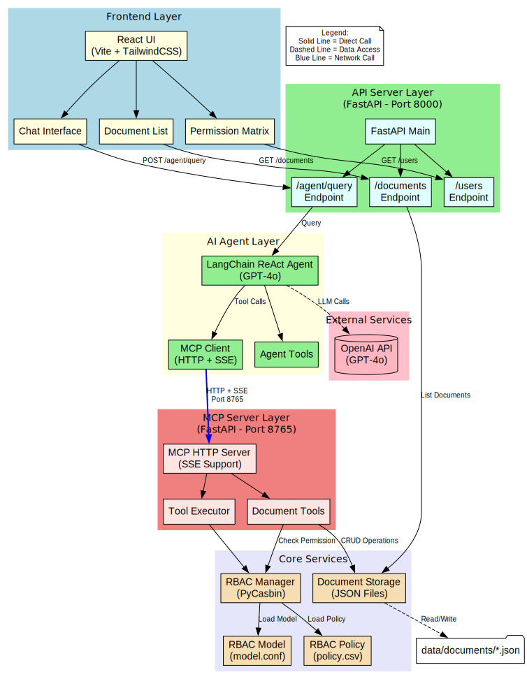

**# AI Agent with MCP Tools and RBAC**

A production-ready AI Agent system that combines the Model Context Protocol (MCP), LangChain ReAct Agent, and Role-Based Access Control (RBAC) using PyCasbin. This application demonstrates secure AI agent operations with enterprise-grade permission management.

## Overview

This application implements a document management system where users with different roles (Admin, Editor, Viewer) interact with an AI agent. The agent autonomously selects and executes tools based on natural language queries, with all operations protected by RBAC policies.

### Key Features

- **MCP Protocol**: HTTP + Server-Sent Events (SSE) for efficient communication
- **RBAC Control**: PyCasbin-based permission management
- **LangChain Integration**: ReAct Agent with OpenAI GPT-4o
- **Enterprise UI**: Modern, clean interface built with React and TailwindCSS
- **Real-time Updates**: Live document management and permission enforcement
- **Security**: Multi-layer defense with logging and audit trails

## System Architecture



```
User Interface (React)
         ↓
   API Server (FastAPI)
         ↓
LangChain ReAct Agent (GPT-4o)
         ↓
   MCP Client (HTTP + SSE)
         ↓
   MCP Server (FastAPI)
         ↓
  RBAC Manager (PyCasbin) + Document Storage
```

## Role Permissions

| Role   | Create | Read | Update | Delete |
|--------|--------|------|--------|--------|
| Admin  | ✅     | ✅   | ✅     | ✅     |
| Editor | ✅     | ✅   | ✅     | ❌     |
| Viewer | ❌     | ✅   | ❌     | ❌     |

### Default Users

- **alice** (Admin): Full access to all operations
- **bob** (Editor): Can create, read, and update documents
- **charlie** (Viewer): Read-only access

## Installation

### 1. Clone and Setup Environment

```bash
git clone https://github.com/AIAnytime/AI-Agent-with-MCP-Tools.git
cd AI-Agent-with-MCP-Tools
cd backend
activate .venv
```

### 2. Install Python Dependencies

```bash
pip install -r requirements.txt
```

### 3. Configure Environment Variables

The `.env` file should contain:

```
OPENAI_API_KEY=your_openai_api_key_here
```

### 4. Install Frontend Dependencies

```bash
cd frontend
npm install
cd ..
```

## Running the Application

### Option 1: Start All Services at Once (Recommended)

```bash
chmod +x start_all.sh
./start_all.sh
```

This will start:
- MCP Server on `http://localhost:8765`
- API Server on `http://localhost:8000`
- Frontend on `http://localhost:3000`

## Usage

1. **Open the application** at `http://localhost:3000`

2. **Select a user** from the User Selector (alice, bob, or charlie)

3. **Chat with the AI Agent** using natural language:
   - "Create a document called 'project-plan' with content 'Q4 Project Planning'"
   - "List all documents"
   - "Read the document 'project-plan'"
   - "Update document 'project-plan' with new content"
   - "Delete the document 'project-plan'"
   - "Check my permissions"

4. **View Documents** in the Documents tab to see all created documents

5. **Check Permissions** in the Permissions tab to see the RBAC matrix

6. **Learn About the System** in the System Architecture tab

## Example Demonstrations

### Admin User (alice) - Full Access

```
Query: "Create a document called 'quarterly-report' with content 'Q4 2024 Report'"
Result: ✅ Document created successfully

Query: "Delete the document 'quarterly-report'"
Result: ✅ Document deleted successfully
```

### Editor User (bob) - No Delete Permission

```
Query: "Create a document called 'meeting-notes' with content 'Team Meeting Notes'"
Result: ✅ Document created successfully

Query: "Delete the document 'meeting-notes'"
Result: ❌ Permission denied: Editor role cannot delete documents
```

### Viewer User (charlie) - Read Only

```
Query: "Read the document 'meeting-notes'"
Result: ✅ Document content displayed

Query: "Update document 'meeting-notes' with 'Updated Notes'"
Result: ❌ Permission denied: Viewer role cannot update documents
```

## Project Structure

```
mcp-rbac-app/
├── backend/
│   ├── api/
│   │   └── main.py              # FastAPI backend for frontend
│   ├── agent/
│   │   └── langchain_agent.py   # LangChain ReAct Agent
│   ├── mcp/
│   │   ├── mcp_server.py        # MCP HTTP Server
│   │   ├── mcp_client.py        # MCP Client
│   │   └── document_tools.py    # Document CRUD tools
│   ├── rbac/
│   │   ├── model.conf           # Casbin RBAC model
│   │   ├── policy.csv           # Casbin policies
│   │   └── rbac_manager.py      # RBAC enforcement
│   └── storage/
│       └── document_storage.py  # Document persistence
├── frontend/
│   ├── src/
│   │   ├── components/          # React components
│   │   ├── api/                 # API client
│   │   ├── App.jsx              # Main app component
│   │   └── main.jsx             # Entry point
│   ├── package.json
│   └── vite.config.js
├── data/
│   └── documents/               # Document storage (auto-created)
├── .env                         # Environment variables
├── requirements.txt             # Python dependencies
├── start_all.sh                 # Start all services
└── README.md                    # This file
```

## ReAct Agent Flow

The LangChain ReAct Agent follows this reasoning loop:

1. **Question**: Receives user's natural language query
2. **Thought**: Analyzes what action is needed
3. **Action Selection**: Chooses appropriate MCP tool
4. **Action Input**: Prepares parameters for tool execution
5. **Tool Execution**: MCP server executes with RBAC check
6. **Observation**: Receives and analyzes result
7. **Task Complete?**: Determines if goal achieved or continues loop
8. **Final Answer**: Returns result to user

## Security Features

### 1. Principle of Least Privilege
Each role has only the minimum necessary permissions.

### 2. Default Deny
All operations are denied unless explicitly allowed in the policy.

### 3. Operation Logging
All permission checks and operations are logged for audit purposes.

### 4. Pre-execution Validation
Permissions are validated before any tool execution.

## API Endpoints

### MCP Server (Port 8765)
- `GET /` - Health check
- `GET /tools/list` - List available tools
- `POST /tools/call` - Execute tool (returns task_id)
- `GET /stream/{task_id}` - SSE stream for tool execution

### API Server (Port 8000)
- `GET /` - Health check
- `GET /users` - Get all users and roles
- `GET /permissions/{role}` - Get permissions for role
- `GET /documents` - List all documents
- `POST /agent/query` - Send query to AI agent

## License

This project is created for educational and demonstration purposes with MIT License.
**
